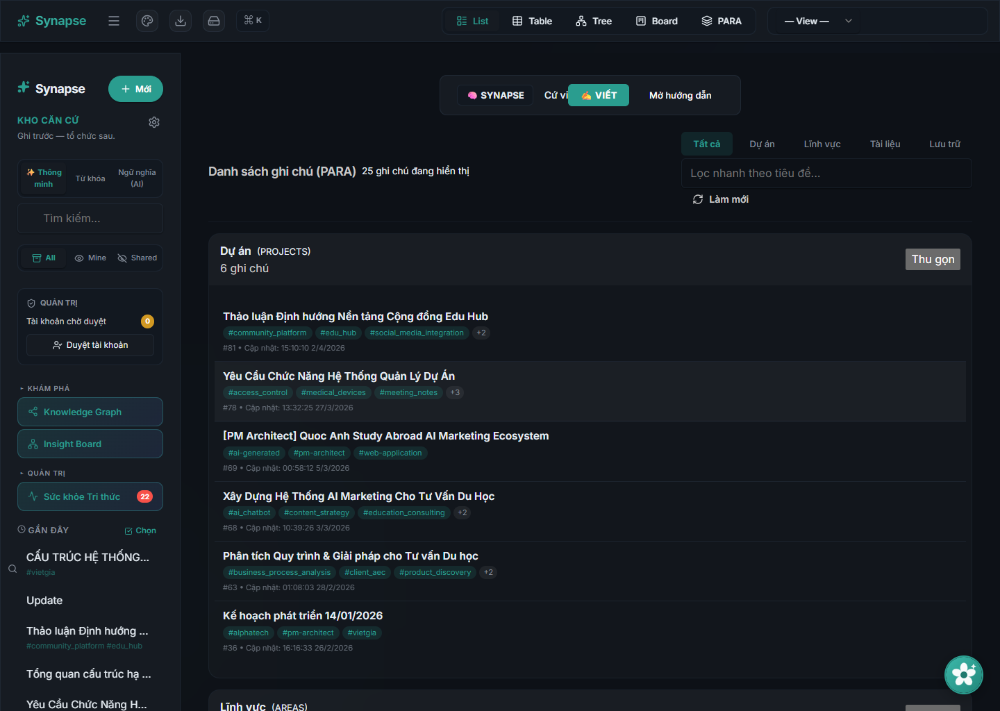
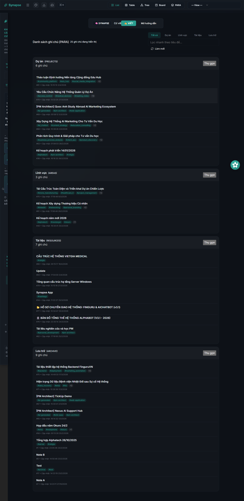
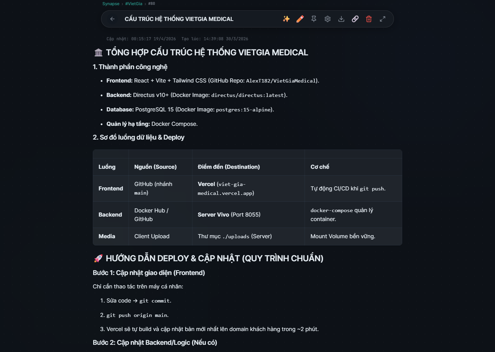
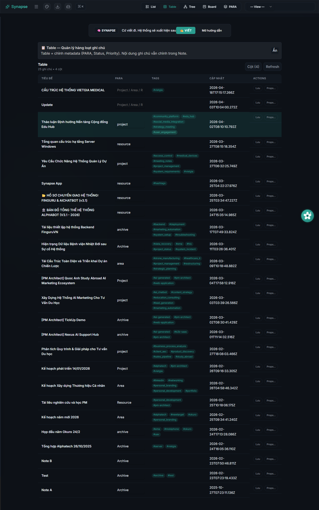
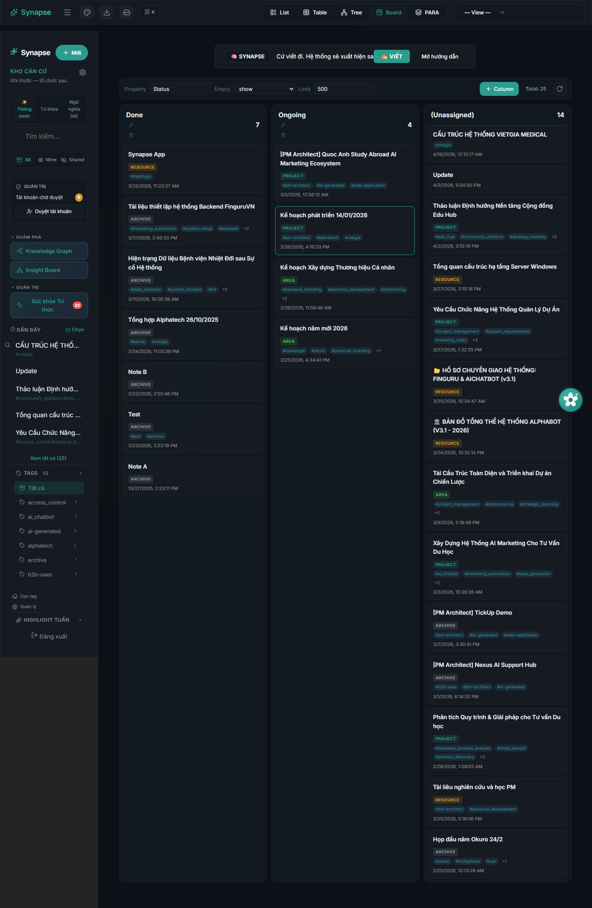
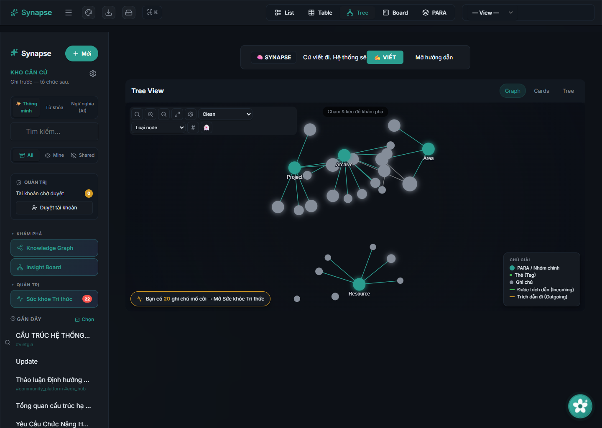
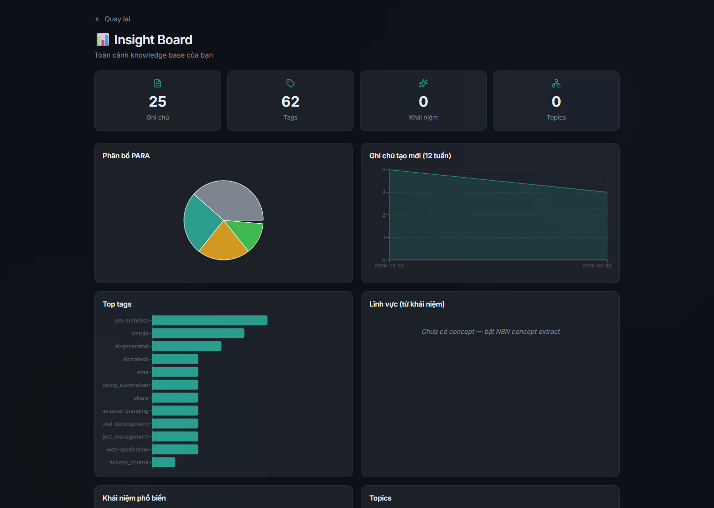
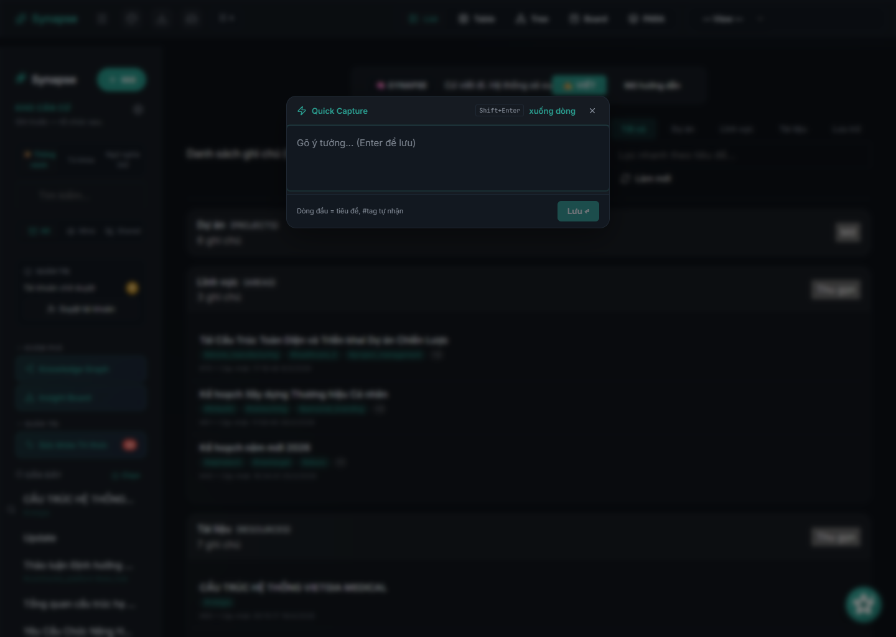
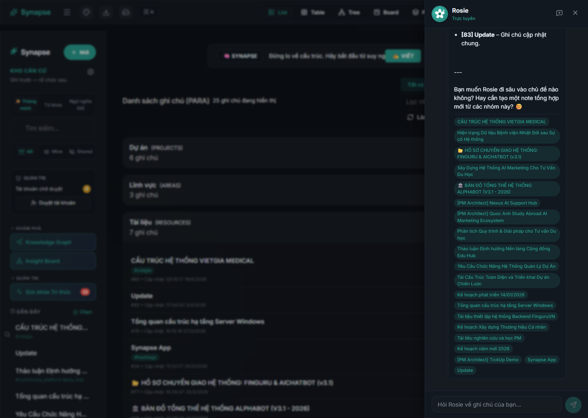

# Synapse

  

  <strong>Không gian làm việc tri thức có AI, giúp ghi chú nhanh trước, tổ chức sau, rồi truy xuất ý nghĩa trên toàn bộ kho kiến thức.</strong>

  Synapse kết hợp ghi chú, tìm kiếm ngữ nghĩa, sơ đồ liên kết, AI tổng hợp
  và nhiều chế độ xem trong một không gian làm việc trên web dành cho tri thức cá nhân hoặc nhóm nhỏ.

  
  
  
  

  <a href="README.md"><strong>Read in English</strong></a>
  |
  <strong>Đọc bằng tiếng Việt</strong>

  <a href="https://synapse.alphatech.ai.vn/"><strong>Live Site</strong></a>
  |
  <a href="SUPPORT.md"><strong>Hỗ trợ</strong></a>
  |
  <a href="docs/FAQ.md"><strong>FAQ</strong></a>

## Thay đổi cốt lõi

Phần lớn công cụ quản lý tri thức cá nhân vẫn để người dùng tự giải quyết phần khó nhất:

- Ghi chú tăng nhanh hơn khả năng tổ chức.
- Tìm kiếm phụ thuộc quá nhiều vào việc nhớ đúng từ.
- Ý tưởng bị phân mảnh.
- AI trả lời thiếu chắc vì nền kiến thức rời rạc.
- Nhóm làm việc và người xây dựng sản phẩm cứ phải viết lại những điều đã nằm đâu đó trong ghi chú.

Synapse thay đổi vòng lặp đó.

Sản phẩm cho phép ghi trước, rồi bổ sung cấu trúc dần qua thẻ, liên kết ghi chú, thuộc tính, PARA, tìm kiếm ngữ nghĩa, sơ đồ liên kết, trích xuất khái niệm, bản đồ chủ đề và AI tổng hợp.

Điểm đáng nhớ không chỉ là AI có thể trả lời.
Điểm đáng nhớ là ghi chú, quan hệ, tìm kiếm và tổng hợp cùng vận hành trên một không gian tri thức đang lớn dần.

> Từ ghi chú rời rạc thành một hệ tri thức có thể tái sử dụng.

## Vì sao Synapse khác

1. **Ghi lại** ý tưởng mà không buộc người dùng phải cấu trúc quá sớm.
2. **Kết nối** các ghi chú bằng liên kết, siêu dữ liệu, vector ngữ nghĩa và sơ đồ liên kết.
3. **Tổng hợp** kho tri thức bằng trò chuyện AI, tóm tắt, gợi ý phân tích và chế độ xem theo chủ đề.

Kho lưu trữ này là nơi giới thiệu sản phẩm và điều hướng hỗ trợ công khai cho Synapse. Nó không chứa mã nguồn ứng dụng.

## Bạn nhận được gì

- `Không gian tri thức` cho ghi chú, mẫu ghi chú và ghi nhanh.
- `Nhiều chế độ xem` gồm danh sách, bảng, bảng công việc, cây, sơ đồ liên kết và PARA.
- `Lớp AI` cho Rosie, tóm tắt từng ghi chú, tóm tắt theo thời gian và tổng hợp nội dung.
- `Tri thức có kết nối` qua liên kết ghi chú, liên kết ngược, quan hệ phân loại, khái niệm và chủ đề.
- `Tích hợp` cho chia sẻ công khai, nhận ghi chú qua khóa API, nhận nội dung từ Telegram và thông báo đẩy.

## Tổng quan nhanh

- Sản phẩm web được lưu trữ sẵn.
- Không gian làm việc có đăng nhập.
- Ghi chú và siêu dữ liệu.
- Sơ đồ tri thức và các chế độ xem quan hệ.
- Tìm kiếm ngữ nghĩa và tìm kiếm kết hợp.
- Truy xuất và tổng hợp bằng AI.

## Hình ảnh thực tế

  
  

  
  

  
  

  
  

Các màn đã chụp từ ứng dụng đang chạy hiện tại:

- Bảng điều khiển với cấu trúc PARA.
- Trình soạn thảo ghi chú với nội dung có cấu trúc.
- Chế độ xem dạng bảng để quản lý siêu dữ liệu hàng loạt.
- Chế độ xem bảng công việc để tổ chức tiến độ.
- Sơ đồ liên kết để khám phá mối liên hệ tri thức.
- Bảng phân tích để thống kê kho tri thức.
- Hộp ghi nhanh để ghi lại ý tưởng tức thời.
- Rosie với phản hồi thật từ ứng dụng đang chạy.

## Phù hợp với ai

- Người xây dựng sản phẩm và người vận hành cần quản lý tri thức về sản phẩm, cuộc họp và kế hoạch.
- Lập trình viên cần lưu ghi chú kỹ thuật và bối cảnh dự án.
- Người nghiên cứu hoặc người học muốn xây mạng lưới chủ đề theo thời gian.
- Người dùng chuyên sâu cần nhiều hơn một ứng dụng ghi chú cơ bản.

## Synapse làm gì

- Lấy `ghi chú` làm đối tượng trung tâm.
- Hỗ trợ ghi nhanh rồi tổ chức sau.
- Cung cấp nhiều góc nhìn trên cùng một kho ghi chú.
- Dùng tìm kiếm ngữ nghĩa và truy xuất bằng AI để tìm đúng ghi chú.
- Tạo bản tóm tắt, gợi ý phân tích, khái niệm và bản đồ chủ đề từ dữ liệu sẵn có.
- Hỗ trợ chia sẻ có kiểm soát và nhận nội dung từ bên ngoài.

## Vì sao sản phẩm tồn tại

Synapse không chỉ muốn là một trình soạn thảo Markdown hay một ô trò chuyện AI.

Nó giải một bài toán thực tế hơn:

> "Mọi người ghi lại rất nhiều điều hữu ích mỗi ngày, nhưng đa số hệ thống vẫn khiến việc biến đống ghi chú đó thành một kho tri thức có kết nối, có thể tìm và có thể tái sử dụng trở nên quá khó."

Vì vậy sản phẩm nằm ở giao điểm giữa quản lý tri thức cá nhân, truy xuất bằng AI và làm việc tri thức có cấu trúc.

## Vì sao người dùng nhớ nó

- Cấu trúc có thể hình thành sau khi ghi lại ý tưởng.
- Tìm kiếm dựa trên ý nghĩa chứ không chỉ dựa trên từ khóa.
- AI có bộ nhớ làm việc tốt hơn nhờ nền ghi chú.
- Một bộ ghi chú có thể dùng cho nhiều kiểu vận hành khác nhau.

## Ranh giới sản phẩm

### Đã có hiện tại

- Không gian làm việc trên web được lưu trữ sẵn.
- Đăng nhập và luồng truy cập của người dùng.
- Tạo, sửa, xóa ghi chú và ghi nhanh.
- Thẻ, thuộc tính, liên kết ngược và quan hệ phân loại.
- Các chế độ xem dạng danh sách, bảng, bảng công việc, cây, sơ đồ liên kết và PARA.
- Rosie và các luồng tóm tắt nội dung.
- Trích xuất khái niệm và tạo chủ đề.
- Chia sẻ, nhận nội dung qua khóa API, nhận nội dung từ Telegram và thông báo đẩy.

### Lưu ý quan trọng

- Synapse không phải ứng dụng quản lý tri thức mã nguồn mở.
- Kho lưu trữ này không phải nơi chứa mã nguồn hay cấu hình triển khai.
- Một số tính năng AI phụ thuộc vào nhà cung cấp dịch vụ và các quy trình đã cấu hình.
- Chất lượng đầu ra phụ thuộc vào chất lượng kho ghi chú và bước rà soát của người dùng.

## Mô hình riêng tư

Synapse là một sản phẩm web được lưu trữ sẵn.

Ở mức tổng quan:

- Người dùng đã xác thực làm việc trong không gian ghi chú.
- Ghi chú, siêu dữ liệu, quan hệ và nội dung đầu ra có thể được lưu phía máy chủ để vận hành sản phẩm.
- Các dịch vụ AI và tích hợp đã cấu hình có thể xử lý nội dung trong quá trình tìm kiếm, tóm tắt hoặc chạy quy trình.
- Ghi chú chia sẻ hoặc liên kết công khai chỉ lộ ra phần nội dung mà người dùng chủ động công bố qua các tính năng đó.

Xem [docs/PRIVACY.md](docs/PRIVACY.md) để biết bản tóm tắt riêng tư công khai.

## Các lớp bề mặt sản phẩm

- Lớp không gian làm việc: ghi chú, chế độ xem, sơ đồ liên kết, tìm kiếm và gợi ý phân tích.
- Lớp AI: Rosie, bản tóm tắt, khái niệm và chủ đề.
- Lớp chia sẻ và tích hợp: chia sẻ, nhận nội dung qua khóa API, Telegram và thông báo đẩy.

## Truy cập

- Live site: https://synapse.alphatech.ai.vn/
- Loại sản phẩm: Không gian tri thức có AI trên web.
- Trạng thái hiện tại: Sản phẩm đang hoạt động với không gian làm việc có đăng nhập.

## 3 bước bắt đầu

1. **Mở** trang đang hoạt động và đăng nhập vào không gian làm việc.
2. **Tạo** hoặc nhập ghi chú, rồi tổ chức bằng thẻ, liên kết, thuộc tính và các chế độ xem.
3. **Dùng** Rosie, tìm kiếm, tóm tắt và sơ đồ liên kết để truy xuất và tổng hợp tri thức.

## Bắt đầu từ đây

- `Live site`: https://synapse.alphatech.ai.vn/
- `Support`: [SUPPORT.md](SUPPORT.md)
- `FAQ`: [docs/FAQ.md](docs/FAQ.md)
- `Roadmap`: [docs/ROADMAP.md](docs/ROADMAP.md)

## Hỗ trợ

- Email: `taminhquan182@gmail.com`

## Khám phá Synapse

  <strong>Muốn xem cách ghi chú nhanh, truy xuất ngữ nghĩa và tổng hợp bằng AI có thể sống chung trong một không gian làm việc?</strong> 
  Hãy xem sản phẩm đang hoạt động trước, rồi dùng đường hỗ trợ cho các câu hỏi về truy cập và sản phẩm.

  <a href="https://synapse.alphatech.ai.vn/"><strong>Mở Live Site</strong></a>
  |
  <a href="SUPPORT.md"><strong>Liên hệ hỗ trợ</strong></a>

## Ghi chú closed-source

Synapse là sản phẩm closed-source của AlphaTech.

Kho lưu trữ này tồn tại để:

- Giải thích sản phẩm.
- Mô tả năng lực hiện tại.
- Công bố hình ảnh và tài liệu công khai.
- Cung cấp đường hỗ trợ và báo lỗi bảo mật.

Kho lưu trữ này không bao gồm:

- Mã nguồn ứng dụng.
- Mã phía máy chủ hoặc mã triển khai nội bộ.
- Thông tin đăng nhập của người dùng.
- Hạ tầng bí mật hoặc khóa bảo mật.
- Dữ liệu riêng tư trong không gian làm việc.

## Phạm vi kho lưu trữ

Kho này nên chỉ chứa tài liệu công khai:

- Giới thiệu sản phẩm.
- FAQ.
- Tóm tắt quyền riêng tư.
- Lộ trình công khai.
- Đầu mối hỗ trợ và bảo mật.
- Hình ảnh minh họa.

Nếu sau này có trang tài liệu công khai hoặc quy trình phát hành công khai, điều đó cần được mô tả rõ ràng thay vì để người đọc tự suy diễn từ kho lưu trữ này.
