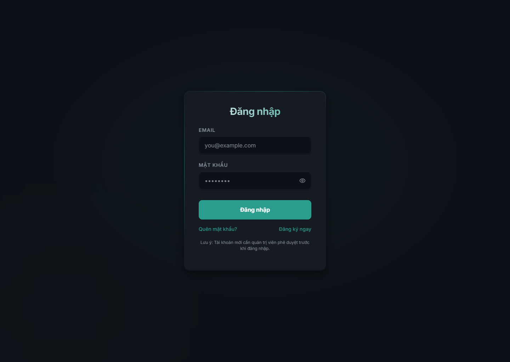
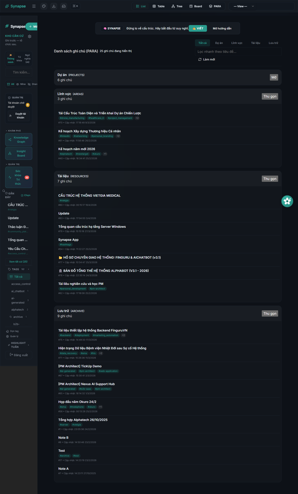

# Synapse

  <strong>Không gian làm việc tri thức có AI, giúp ghi chú nhanh trước, tổ chức sau, rồi truy xuất ý nghĩa trên toàn bộ kho kiến thức.</strong>

  Synapse kết hợp ghi chú, tìm kiếm ngữ nghĩa, graph quan hệ, AI tổng hợp
  và nhiều chế độ xem trong một workspace web dành cho tri thức cá nhân hoặc nhóm nhỏ.

  
  
  
  

  <a href="README.md"><strong>Read in English</strong></a>
  |
  <strong>Đọc bằng tiếng Việt</strong>

  <a href="https://synapse.alphatech.ai.vn/"><strong>Live Site</strong></a>
  |
  <a href="SUPPORT.md"><strong>Hỗ trợ</strong></a>
  |
  <a href="docs/FAQ.md"><strong>FAQ</strong></a>

## Thay đổi cốt lõi

Phần lớn công cụ quản lý tri thức cá nhân vẫn để người dùng tự giải quyết phần khó nhất:

- Ghi chú tăng nhanh hơn khả năng tổ chức.
- Tìm kiếm phụ thuộc quá nhiều vào việc nhớ đúng từ.
- Ý tưởng bị phân mảnh.
- AI trả lời thiếu chắc vì nền kiến thức rời rạc.
- Team và founder cứ phải viết lại những điều đã nằm đâu đó trong note.

Synapse thay đổi vòng lặp đó.

Sản phẩm cho phép ghi trước, rồi bổ sung cấu trúc dần qua tag, wikilink, properties, PARA, semantic search, graph quan hệ, trích xuất concept, topic map và AI tổng hợp.

Điểm đáng nhớ không chỉ là AI có thể trả lời.
Điểm đáng nhớ là note, quan hệ, search và synthesis cùng vận hành trên một workspace tri thức đang lớn dần.

> Từ ghi chú rời rạc thành một hệ tri thức có thể tái sử dụng.

## Vì sao Synapse khác

1. **Ghi lại** ý tưởng mà không buộc người dùng phải cấu trúc quá sớm.
2. **Kết nối** các note bằng link, metadata, embedding và graph.
3. **Tổng hợp** kho tri thức bằng AI chat, summary, insight và topic view.

Repository này là public product-information và support hub cho Synapse. Nó không chứa source code ứng dụng.

## Bạn nhận được gì

- `Knowledge Workspace` cho note, template và quick capture.
- `Multiple Views` gồm list, table, board, tree, graph và PARA.
- `AI Layer` cho Rosie chat, summary từng note, summary theo khoảng thời gian và synthesis.
- `Connected Knowledge` qua wikilink, backlink, typed relations, concepts và topics.
- `Integrations` cho public sharing, API-key inbound capture, Telegram ingestion và push notifications.

## Tổng quan nhanh

- Sản phẩm web hosted.
- Workspace có đăng nhập.
- Ghi chú và metadata.
- Knowledge graph và relationship views.
- Semantic search và hybrid search.
- AI retrieval và synthesis.

## Hình ảnh thực tế

  
  
  

  
  
  

Các màn đã chụp từ app live hiện tại:

- Màn hình đăng nhập.
- Dashboard với cấu trúc PARA.
- Graph view để khám phá liên kết tri thức.
- Board view cho tổ chức công việc.
- Insight Board cho thống kê knowledge base.
- Rosie AI chat drawer.

## Phù hợp với ai

- Founder và operator quản lý kiến thức sản phẩm, họp, kế hoạch.
- Developer lưu note kỹ thuật và bối cảnh dự án.
- Researcher hoặc learner xây mạng lưới chủ đề theo thời gian.
- Power user cần nhiều hơn một app ghi chú cơ bản.

## Synapse làm gì

- Lấy `notes` làm đối tượng trung tâm.
- Hỗ trợ ghi nhanh rồi tổ chức sau.
- Cung cấp nhiều góc nhìn trên cùng một kho note.
- Dùng semantic search và AI retrieval để tìm đúng note.
- Tạo summary, insight, concept và topic map từ dữ liệu sẵn có.
- Hỗ trợ sharing có kiểm soát và inbound capture từ bên ngoài.

## Vì sao sản phẩm tồn tại

Synapse không chỉ muốn là một markdown editor hay một ô chat AI.

Nó giải một bài toán thực tế hơn:

> "Mọi người ghi lại rất nhiều điều hữu ích mỗi ngày, nhưng đa số hệ thống vẫn khiến việc biến đống note đó thành một kho tri thức có kết nối, có thể tìm, có thể tái sử dụng trở nên quá khó."

Vì vậy sản phẩm nằm giữa PKM, AI retrieval và structured knowledge work.

## Vì sao người dùng nhớ nó

- Cấu trúc có thể hình thành sau khi capture.
- Search theo nghĩa chứ không chỉ theo từ khóa.
- AI có bộ nhớ làm việc tốt hơn nhờ nền note.
- Một bộ note có thể dùng cho nhiều kiểu vận hành khác nhau.

## Ranh giới sản phẩm

### Đã có hiện tại

- Hosted web workspace.
- Login và user access flow.
- Note CRUD và quick capture.
- Tags, properties, backlinks và typed relations.
- List, table, board, tree, graph và PARA views.
- Rosie AI chat và các flow summary.
- Concept extraction và topic generation.
- Sharing, API capture, Telegram ingestion và notifications.

### Lưu ý quan trọng

- Synapse không phải ứng dụng quản lý tri thức mã nguồn mở.
- Repository này không phải repo source hay deployment.
- Một số tính năng AI phụ thuộc provider và workflow được cấu hình.
- Chất lượng output phụ thuộc chất lượng kho note và bước review của người dùng.

## Mô hình riêng tư

Synapse là một sản phẩm web hosted.

Ở mức tổng quan:

- Người dùng đã xác thực làm việc trong workspace ghi chú.
- Notes, metadata, relations và generated outputs có thể được lưu phía server để vận hành sản phẩm.
- AI provider và integration provider được cấu hình có thể xử lý nội dung trong quá trình search, summary hoặc workflow execution.
- Shared notes hoặc public links chỉ lộ ra nội dung được người dùng chủ động chia sẻ qua các tính năng đó.

Xem [docs/PRIVACY.md](docs/PRIVACY.md) để biết bản tóm tắt riêng tư công khai.

## Các lớp bề mặt sản phẩm

- Workspace layer: notes, views, graph, search, insights.
- AI layer: Rosie chat, summaries, concepts, topics.
- Sharing và integration layer: shares, API capture, Telegram, notifications.

## Truy cập

- Live site: https://synapse.alphatech.ai.vn/
- Loại sản phẩm: hosted AI knowledge workspace
- Trạng thái hiện tại: sản phẩm live với workspace có đăng nhập

## 3 bước bắt đầu

1. **Mở** live site và đăng nhập vào workspace.
2. **Tạo** hoặc nhập note, rồi tổ chức bằng tags, links, properties và views.
3. **Dùng** Rosie, search, summaries và graph để truy xuất và tổng hợp tri thức.

## Bắt đầu từ đây

- `Live site`: https://synapse.alphatech.ai.vn/
- `Support`: [SUPPORT.md](SUPPORT.md)
- `FAQ`: [docs/FAQ.md](docs/FAQ.md)
- `Roadmap`: [docs/ROADMAP.md](docs/ROADMAP.md)

## Hỗ trợ

- Email: `taminhquan182@gmail.com`

## Khám phá Synapse

  <strong>Muốn xem cách note capture, semantic retrieval và AI synthesis có thể sống chung trong một workspace?</strong> 
  Hãy xem live product trước, rồi dùng đường hỗ trợ cho câu hỏi về truy cập và sản phẩm.

  <a href="https://synapse.alphatech.ai.vn/"><strong>Mở Live Site</strong></a>
  |
  <a href="SUPPORT.md"><strong>Liên hệ hỗ trợ</strong></a>

## Ghi chú closed-source

Synapse là sản phẩm closed-source của AlphaTech.

Repository này tồn tại để:

- Giải thích sản phẩm.
- Mô tả năng lực hiện tại.
- Công bố screenshot và tài liệu public.
- Cung cấp đường hỗ trợ và báo lỗi bảo mật.

Repository này không bao gồm:

- Source code ứng dụng.
- Backend hoặc deployment code nội bộ.
- Credential người dùng.
- Hạ tầng bí mật hoặc key.
- Dữ liệu workspace riêng tư.

## Phạm vi repository

Repo này nên chỉ chứa tài liệu public-facing:

- Product overview.
- FAQ.
- Privacy summary.
- Roadmap.
- Support và security contacts.
- Screenshots.

Nếu sau này có documentation site công khai hoặc release flow công khai, điều đó cần được mô tả rõ ràng thay vì để người đọc tự suy diễn từ repository này.
